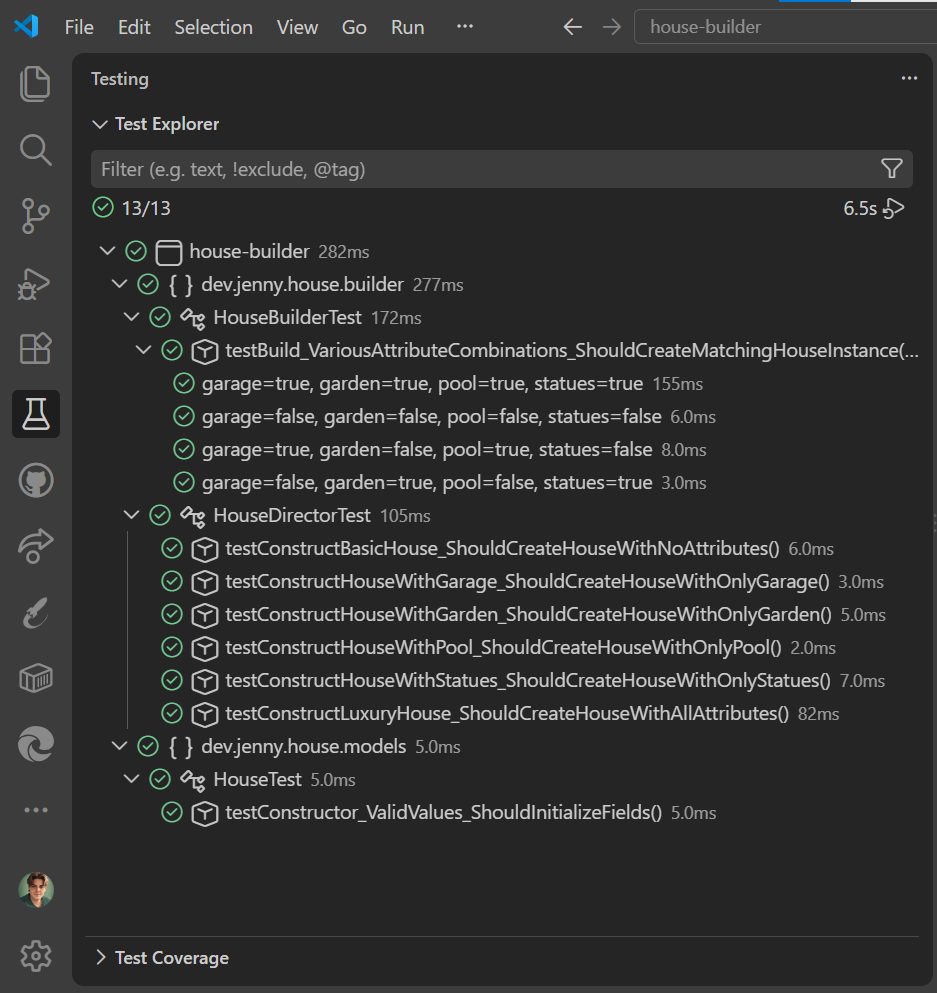
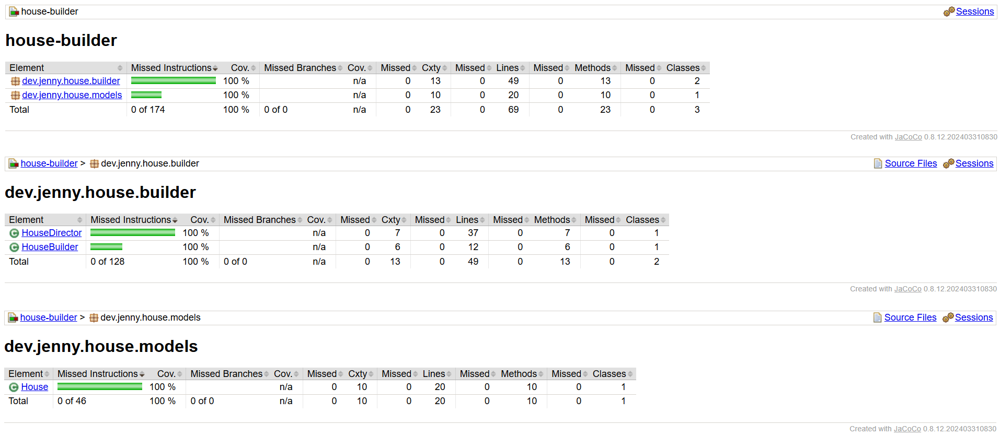
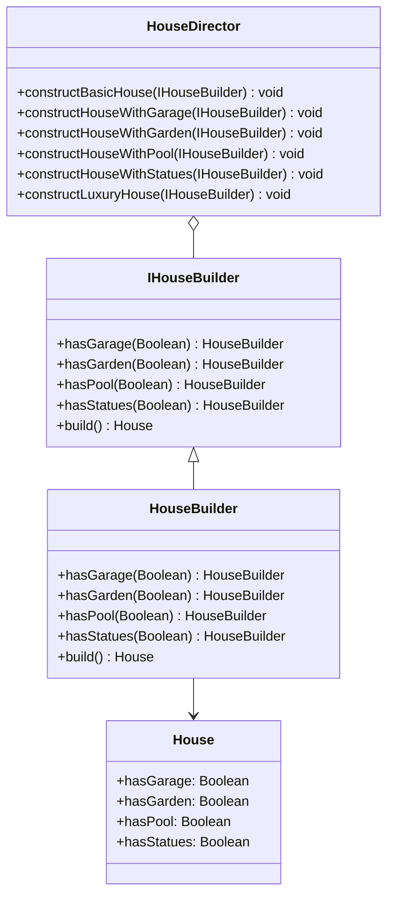

# 🏠 House Builder

> Aquí las casas se levantan paso a paso, con `.build()`

Proyecto en **Java 21** con **Maven** que aplica el patrón de diseño **Builder** (GoF) a una entidad `House`, permitiendo construir distintos tipos de casa a partir de una combinación de características (garaje, jardín, piscina, estatuas decorativas) de forma flexible, escalable y desacoplada. Desarrollado siguiendo **TDD** (**JUnit 5 + Hamcrest**), con cobertura de tests medida con **JaCoCo**.

---

## 📸 Vista previa

| Test | Cobertura |
| :---: | :---: |
|  |  |

---

## 📑 Índice

- [Descripción](#-descripción)
- [Cómo reproducir el proyecto](#-cómo-reproducir-el-proyecto)
- [Estructura del repositorio](#-estructura-del-repositorio)
- [Diagrama de clases](#-diagrama-de-clases)
- [Testing](#-testing)
- [Cobertura de tests](#-cobertura-de-tests-coverage)
- [Tecnologías](#-tecnologías)
- [Recursos](#-recursos)
- [Autora](#-autora)

---

## 📋 Descripción

**House Builder** aplica el patrón de diseño creacional **Builder** a la entidad `House`, permitiendo construir distintos tipos de casa sin depender de un único constructor con todos los parámetros posibles.

Cada casa se construye combinando estas características:

- Garaje
- Jardín
- Piscina
- Estatuas decorativas

El builder se implementa mediante una interfaz (`IHouseBuilder`), con `HouseBuilder` como única implementación concreta.

A esto se suma un `HouseDirector`, que aplica la forma completa del patrón Builder tal y como la explica la documentación oficial. Aunque no es estrictamente obligatorio, encapsula las combinaciones de características más habituales en métodos con nombre, dejando el código cliente más simple:

- `constructBasicHouse` — ninguna característica
- `constructHouseWithGarage`, `constructHouseWithGarden`, `constructHouseWithPool`, `constructHouseWithStatues` — una característica cada uno
- `constructLuxuryHouse` — las cuatro características

Los métodos del director son `void` y reciben el builder como parámetro en vez de guardarlo en una instancia fija. Así, el director no queda acoplado a un builder concreto, y puede recibir cualquiera que implemente `IHouseBuilder`. El resultado se obtiene aparte, llamando a `.build()` después de invocar la combinación.

[Volver al índice](#-índice)

---

## 🚀 Cómo reproducir el proyecto

### Requisitos previos

| Herramienta | Requisito | Guía de instalación |
| --- | --- | --- |
| [JDK 21](https://www.oracle.com/java/technologies/downloads/) | Instalado y en el `PATH` | [Ver guía](https://docs.oracle.com/en/java/javase/21/install/overview-jdk-installation.html) |
| [Apache Maven](https://maven.apache.org/download.cgi) | Instalado y en el `PATH` | [Ver guía](https://maven.apache.org/install.html) |
| [Git](https://git-scm.com/downloads) | Instalado y en el `PATH` | [Ver guía](https://git-scm.com/book/es/v2/Inicio---Sobre-el-Control-de-Versiones-Instalaci%C3%B3n-de-Git) |

### Pasos

**1. Comprueba que tienes Java y Maven instalados** (si algún comando no se reconoce, instálalo desde los enlaces de _Requisitos previos_):

```bash
java --version
mvn --version
```

**2. Clona el repositorio:**

```bash
git clone https://github.com/Jennydev-25/house-builder.git
```

**3. Entra en la carpeta del proyecto:**

```bash
cd house-builder
```

**4. Ejecuta los tests** (compila y genera el reporte de cobertura de JaCoCo):

```bash
mvn test
```

El reporte de cobertura se genera en `target/site/jacoco/index.html`, que puedes abrir en el navegador.

[Volver al índice](#-índice)

---

## 📁 Estructura del repositorio

```text
house-builder/
├── assets/
│   └── images/
│       ├── coverage/
│       │   └── coverage-screenshot.png
│       └── test-explorer/
│           └── test-screenshot.png
├── src/
│   ├── main/java/dev/jenny/house/
│   │   ├── models/
│   │   │   └── House.java
│   │   └── builder/
│   │       ├── IHouseBuilder.java
│   │       ├── HouseBuilder.java
│   │       └── HouseDirector.java
│   └── test/java/dev/jenny/house/
│       ├── models/
│       │   └── HouseTest.java
│       └── builder/
│           ├── HouseBuilderTest.java
│           └── HouseDirectorTest.java
├── .editorconfig
├── .gitignore
├── pom.xml
└── README.md
```

[Volver al índice](#-índice)

---

## 📐 Diagrama de clases

Diagrama de clases para representar la relación entre las cuatro piezas del patrón Builder:

- `House` — el producto, un objeto de configuración con cuatro atributos booleanos
- `IHouseBuilder` — el contrato, define las operaciones para construir un `House` paso a paso
- `HouseBuilder` — la implementación, guarda internamente la instancia de `House` que va construyendo
- `HouseDirector` — las combinaciones, no guarda ningún builder como campo, lo recibe como parámetro en cada una

<details>
<summary>Ver diagrama en Mermaid</summary>



</details>
<br>

[Volver al índice](#-índice)

---

## 🧪 Testing

Siguiendo la metodología **TDD**, cada clase se testea cubriendo los escenarios que le corresponden, con **JUnit 5 + Hamcrest**.


| Clase | Escenario | Casos |
| --- | --- | --- |
| `HouseTest` | Inicializa los cuatro atributos con los valores recibidos | 1 |
| `HouseBuilderTest` | Construye una `House` combinando garaje, jardín, piscina y estatuas, y verifica que cada atributo del resultado coincide con lo indicado al builder | 4 (parametrizado) |
| `HouseDirectorTest` | Ninguna característica activada | 1 |
| `HouseDirectorTest` | Solo el garaje activado | 1 |
| `HouseDirectorTest` | Solo el jardín activado | 1 |
| `HouseDirectorTest` | Solo la piscina activada | 1 |
| `HouseDirectorTest` | Solo las estatuas activadas | 1 |
| `HouseDirectorTest` | Las cuatro características activadas | 1 |

> **Nota:** el Test Explorer de VS Code muestra 13/13 porque cuenta los tests parametrizados de otra forma; el número real de tests ejecutados, según Maven Surefire, es 11.

[Volver al índice](#-índice)

---

## 📈 Cobertura de tests (coverage)

Reporte generado con **JaCoCo** tras ejecutar `mvn test`. El informe HTML se genera en `target/site/jacoco/index.html`.


| Métrica | Cobertura |
| --- | --- |
| Instrucciones | 100 % (174 de 174) |
| Ramas | n/a (0 de 0) |
| Líneas | 100 % (69 de 69) |
| Métodos | 100 % (23 de 23) |
| Clases analizadas | 3 |

Las tres clases del proyecto no tienen lógica condicional (`if`/`else`, bucles...), solo asignaciones y llamadas a métodos. Por eso JaCoCo no reporta ninguna rama.

[Volver al índice](#-índice)

---

## 🛠️ Tecnologías

- **[Java 21](https://www.oracle.com/java/technologies/downloads/)** — Lenguaje de programación del proyecto
- **[Apache Maven](https://maven.apache.org/)** — Gestor de dependencias y construcción del proyecto
- **[JUnit 5](https://junit.org/junit5/)** — Framework de tests unitarios
- **[Hamcrest](https://hamcrest.org/JavaHamcrest/)** — Librería de matchers para aserciones legibles
- **[JaCoCo](https://www.jacoco.org/jacoco/)** — Medición de la cobertura de tests
- **[Visual Studio Code](https://code.visualstudio.com/)** — Editor usado para desarrollar y gestionar el proyecto
- **[Markdown](https://www.markdownguide.org/)** — Lenguaje de marcado para el README
- **[Git](https://git-scm.com/)** / **[GitHub](https://github.com/)** — Control de versiones y alojamiento del proyecto

[Volver al índice](#-índice)

---

## 📚 Recursos

- **[Builder — Refactoring Guru](https://refactoring.guru/es/design-patterns/builder)** — Documentación oficial del patrón
- **[Builder in Java — Refactoring Guru](https://refactoring.guru/es/design-patterns/builder/java/example)** — Ejemplo de implementación en Java, seguido para diseñar `HouseDirector`
- **[Mermaid – Class Diagrams](https://mermaid.js.org/syntax/classDiagram.html)** — Documentación de Mermaid para el diagrama de clases
- **[JUnit 5 User Guide](https://junit.org/junit5/docs/current/user-guide/)** — Documentación oficial de JUnit 5
- **[Parameterized Tests in JUnit 5 (Baeldung)](https://www.baeldung.com/parameterized-tests-junit-5)** — Patrón aplicado en `HouseBuilderTest` con `@ParameterizedTest` + `@MethodSource`
- **[Hamcrest – JavaHamcrest](https://hamcrest.org/JavaHamcrest/)** — Documentación de los matchers usados en las aserciones
- **[JaCoCo Maven Plugin](https://www.jacoco.org/jacoco/trunk/doc/maven.html)** — Configuración del plugin y de los umbrales de cobertura en el `pom.xml`

---

## 👩‍💻 Autora

**[Jenny Sánchez Requejo](https://github.com/Jennydev-25)**

[Volver arriba](#-house-builder)
